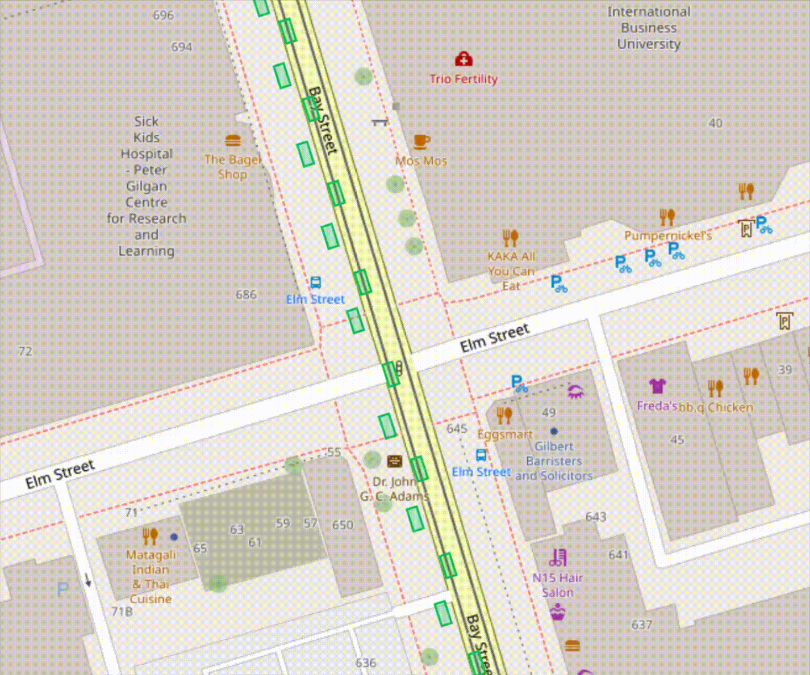

# V2X Viz

A visualizer that receives V2X messages and renders them on a map.

Right now, the project only supports ETSI CAM messages.



## Components

### Visualizer

The visualizer is an `egui` application that uses `walkers` to display an
OpenStreetMap-backed map. It listens for incoming V2X packets over UDP, decodes
them with the shared `v2x` library, and draws vehicles on the map.

### Simulation

The simulation component starts from a SUMO scenario and connects to SUMO via
TraCI. It steps the simulation, extracts vehicle state, encodes ETSI CAM
messages, and publishes the generated packets to a UDP address.

The simulation was used to test the validity of the visualizer.

### v2x

The `v2x` crate contains the shared encoding and decoding helpers used by both
the simulation and the visualizer.

## Running the visualizer

From the repository root:

```bash
cargo run -p visualizer
```

Listen on a different UDP port:

```bash
cargo run -p visualizer -- --listen 0.0.0.0:5000
```

Start the map at a different location:

```bash
cargo run -p visualizer -- \
  --listen 127.0.0.1:5000 \
  --longitude -79.38433 \
  --latitude 43.65734 \
  --zoom 18
```
